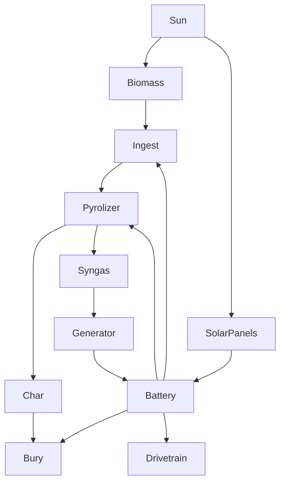

# bexbot

## energy & process flow

## napkin math
900kg hemp per hectare per season\
400kg of biochar produced by pyrolyzing it\
200kg of carbon in that biochar\
10000kg rough personal annual carbon footprint\
∴ 50 hecares, or 120 acres needed to offset
