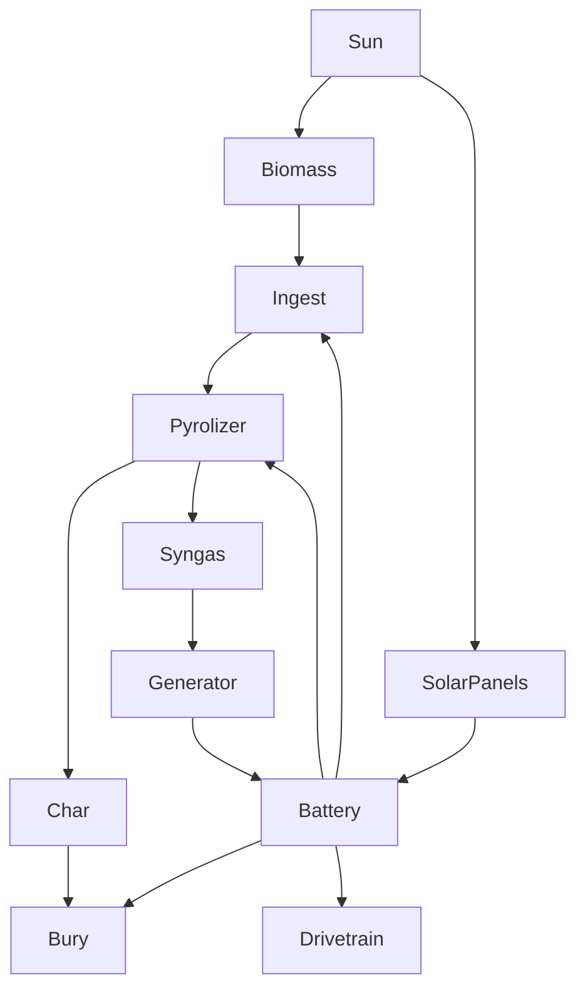

# bexbot

## energy & process flow

it probably makes more sense for the syngas to be directly ignited, rather than sent through a generator, to provide heat for dehydration before pyrolysis

## napkin math
900kg hemp per hectare per season*\
400kg of biochar produced by pyrolyzing it\
200kg of carbon in that biochar\
10000kg of co2 - rough personal annual 'carbon footprint\
2730kg of carbon in that co2 to sequester per year \
13.7 hectares or 34 acres

900kg/ha probably involves irrigation and/or fertilizer so might be half that without

## inspirations
### combine diagram
https://en.wikipedia.org/wiki/Combine_harvester#/media/File:Maehdrescher_schema_nummeriert.svg

